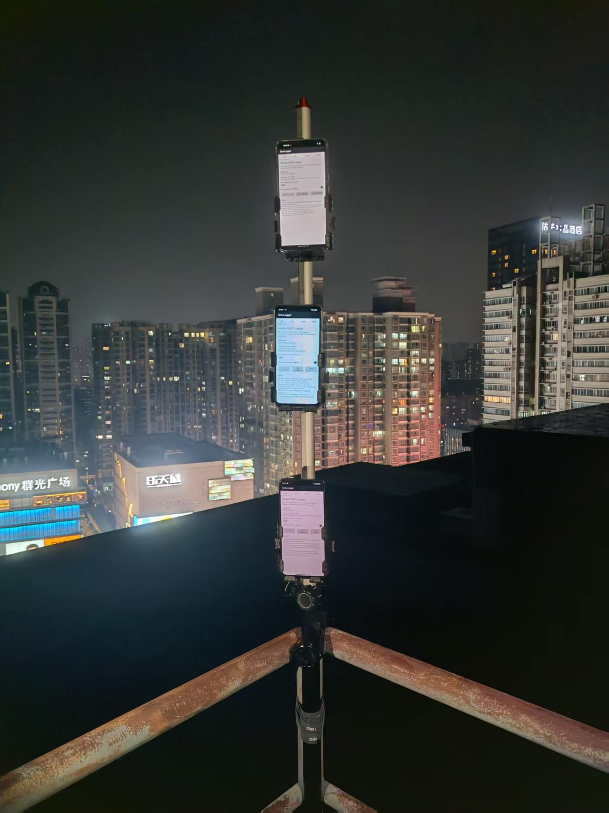
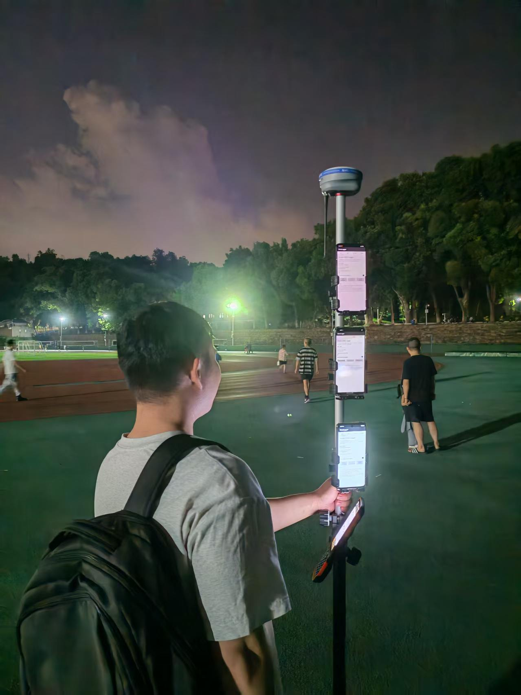
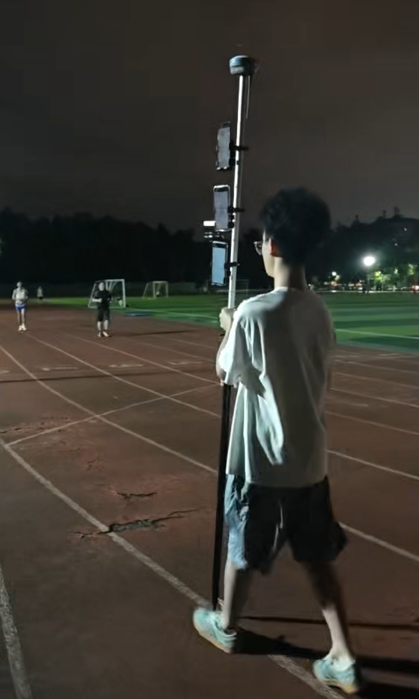
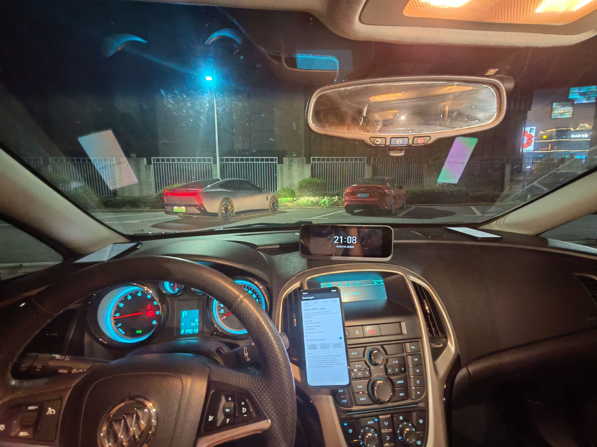
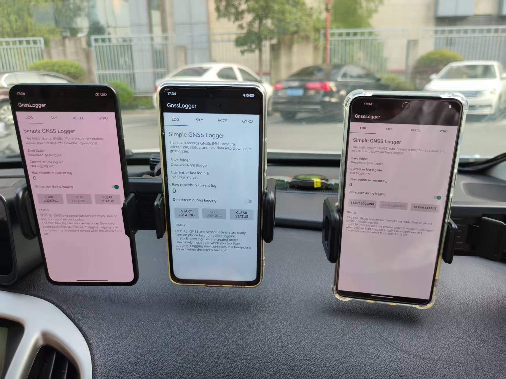
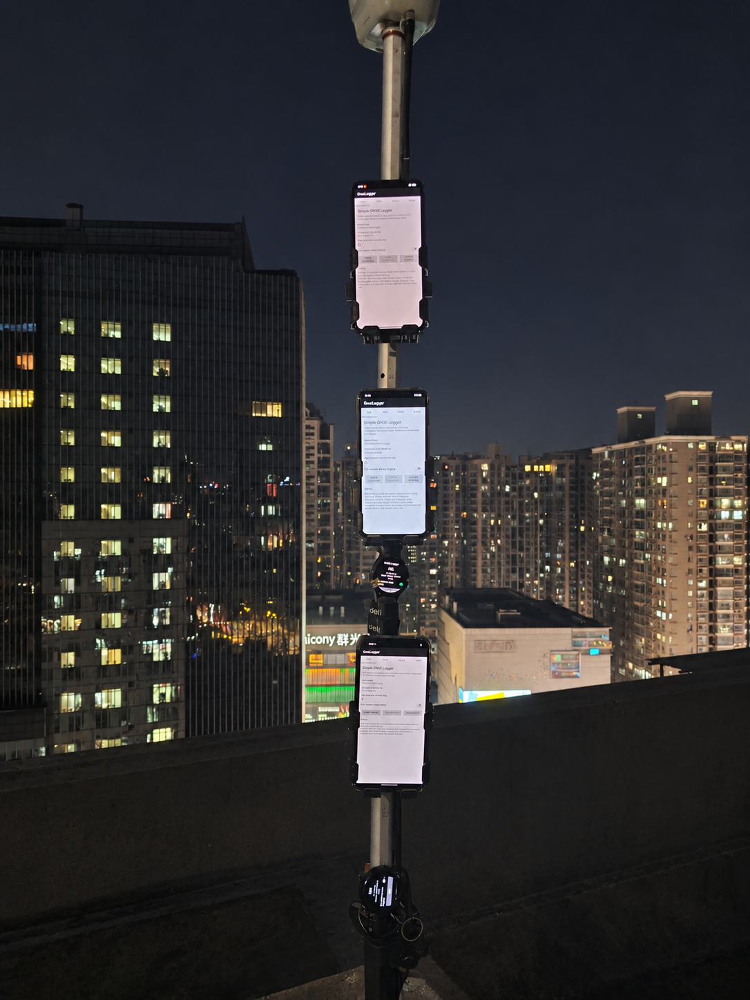

# Wuhan Dataset 2026

武汉地区 2026 年采集的智能手机和智能手表 GNSS/IMU 数据，涵盖静态、操场步行、车载和无线连接状态切换实验。数据按采集批次组织，每个批次包含 Android GNSS 原始日志。

## 目录结构

```text
wuhan_dataset_2026/
├── 0720static/
│   ├── log/
│   └── fig/
├── 0804walk/
│   ├── log/
│   └── fig/
├── 0813walk/
│   ├── log/
│   └── fig/
├── 0827vehicle/
│   ├── log/
│   └── fig/
├── 0907vehicle/
│   ├── log/
│   └── fig/
├── 0915static/
│   ├── log/
│   └── fig/
└── tools/
    ├── apk/
    └── log2data/
```

`log/` 保存 Android GNSS 原始日志，`fig/` 保存采集现场照片。日志可以使用 `tools/log2data/` 转换为 RINEX 观测、IMU 和其他辅助输出。

## 采集场景

- `0720static`：多设备静态采集。
- `0804walk`、`0813walk`：操场步行采集。
- `0827vehicle`、`0907vehicle`：车载采集。
- `0915static`：用于分析 Wi-Fi 和蓝牙连接对智能手机、智能手表 GNSS 观测的影响。设备包括三部智能手机（vivo、Redmi、Google）和两块智能手表（Xiaomi、Samsung）。实验按北京时间分为四个连续阶段：开始记录至约 20:36，Wi-Fi 和蓝牙均未连接；约 20:36 至 20:56，仅连接 Wi-Fi；约 20:56 至 21:10，同时连接 Wi-Fi 和蓝牙；约 21:10 至记录结束，断开 Wi-Fi、保留蓝牙连接。

| 批次 | 日期 | 场景 | 日志文件数 |
| --- | --- | --- | ---: |
| `0720static` | 2026-07-20 | 静态 | 4 |
| `0804walk` | 2026-08-04 | 操场步行 | 3 |
| `0813walk` | 2026-08-13 | 操场步行 | 4 |
| `0827vehicle` | 2026-08-27 | 车载 | 4 |
| `0907vehicle` | 2026-09-07 | 车载 | 5 |
| `0915static` | 2026-09-15 | 静态无线连接实验 | 5 |

## 采集现场照片

| `0720static` | `0804walk` |
| --- | --- |
|  |  |
| `0813walk` | `0827vehicle` |
|  |  |
| `0907vehicle` | `0915static` |
|  |  |

## 日志采集与转换

- `tools/apk/gnsslogger_fu_phone.apk`：手机采集 APK。
- `tools/apk/gnsslogger_fu_wear.apk`：手表采集 APK。
- `tools/log2data/linux/`：Linux 日志转换工具。
- `tools/log2data/win/`：Windows 日志转换工具。

Linux 和 Windows 的运行方法、输入要求、输出命名规则及格式说明，分别见对应目录下的 `README_linux.md` 和 `README_win.md`。

采集 APK 和日志格式基于 Google 开源的 [GnssLogger](https://github.com/google/gps-measurement-tools) 项目。本数据集使用经过修改和修复的版本，包含针对采集流程和日志转换的改动。感谢 Google 及 GnssLogger 开源项目的贡献。

## English Version

# Wuhan Dataset 2026

GNSS/IMU data collected from smartphones and smartwatches in Wuhan in 2026. The dataset covers static, playground walking, vehicle-mounted, and wireless-connectivity transition experiments. Data are organized by collection batch, with each batch containing raw Android GNSS logs.

## Directory Structure

```text
wuhan_dataset_2026/
├── 0720static/
│   ├── log/
│   └── fig/
├── 0804walk/
│   ├── log/
│   └── fig/
├── 0813walk/
│   ├── log/
│   └── fig/
├── 0827vehicle/
│   ├── log/
│   └── fig/
├── 0907vehicle/
│   ├── log/
│   └── fig/
├── 0915static/
│   ├── log/
│   └── fig/
└── tools/
    ├── apk/
    └── log2data/
```

`log/` contains raw Android GNSS logs, while `fig/` contains photographs of the collection setup and scenes. The logs can be processed with `tools/log2data/` to generate RINEX observations, IMU files, and other auxiliary outputs.

## Collection Scenarios

- `0720static`: multi-device static collection.
- `0804walk` and `0813walk`: walking collections on a playground.
- `0827vehicle` and `0907vehicle`: vehicle-mounted collections.
- `0915static`: a controlled experiment designed to analyze how Wi-Fi and Bluetooth connectivity affects GNSS observations from three smartphones (vivo, Redmi, and Google) and two smartwatches (Xiaomi and Samsung). The experiment has four consecutive stages in Beijing Time: from the start of logging to approximately 20:36, neither Wi-Fi nor Bluetooth was connected; from approximately 20:36 to 20:56, only Wi-Fi was connected; from approximately 20:56 to 21:10, both Wi-Fi and Bluetooth were connected; from approximately 21:10 to the end, Wi-Fi was disconnected while Bluetooth remained connected.

| Batch | Date | Scenario | Log files |
| --- | --- | --- | ---: |
| `0720static` | 2026-07-20 | Static | 4 |
| `0804walk` | 2026-08-04 | Playground walking | 3 |
| `0813walk` | 2026-08-13 | Playground walking | 4 |
| `0827vehicle` | 2026-08-27 | Vehicle-mounted | 4 |
| `0907vehicle` | 2026-09-07 | Vehicle-mounted | 5 |
| `0915static` | 2026-09-15 | Static wireless-connectivity experiment | 5 |

## Collection Photos

| `0720static` | `0804walk` |
| --- | --- |
|  |  |
| `0813walk` | `0827vehicle` |
|  |  |
| `0907vehicle` | `0915static` |
|  |  |

## Log Collection and Conversion

- `tools/apk/gnsslogger_fu_phone.apk`: phone collection APK.
- `tools/apk/gnsslogger_fu_wear.apk`: watch collection APK.
- `tools/log2data/linux/`: Linux log-conversion tools.
- `tools/log2data/win/`: Windows log-conversion tools.

See `README_linux.md` and `README_win.md` in the corresponding platform directories for execution instructions, input requirements, output naming rules, and format details.

The collection APKs and log format are based on Google's open-source [GnssLogger](https://github.com/google/gps-measurement-tools) project. This dataset uses a modified and fixed version with changes for the collection workflow and log conversion. We acknowledge and thank Google and the GnssLogger open-source project.
